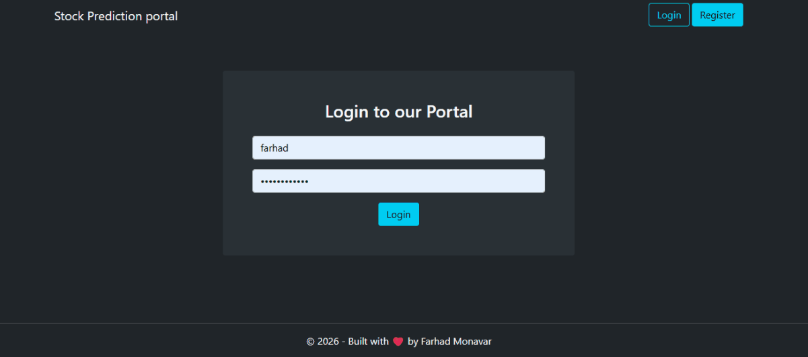

# 📈 Stock Prediction Portal

A full-stack web application that predicts future stock prices using an LSTM (Long Short-Term Memory) neural network. Users can register, log in, and search any stock ticker to view historical trends, moving averages, and a machine-learning-generated price forecast.

Built with **Django REST Framework** on the backend and **React (Vite)** on the frontend.

## Demo



## Features

- 🔐 **User authentication** — registration and login secured with JWT (access + refresh tokens, automatic token refresh on expiry)
- 🔍 **Ticker search** — look up any stock symbol supported by Yahoo Finance
- 📊 **Historical price chart** — 10 years of closing price data pulled live via `yfinance`
- 📉 **Moving averages** — 100-day and 200-day moving average overlays
- 🤖 **ML-powered forecasting** — an LSTM model (trained with Keras/TensorFlow) predicts prices against real test data
- 📈 **Model evaluation metrics** — MSE, RMSE, and R² returned alongside each prediction
- ⚡ **Modern SPA frontend** — built with React 19 and Vite for fast dev/build cycles

## Tech Stack

**Backend**
- Django + Django REST Framework
- `djangorestframework-simplejwt` for JWT authentication
- `django-cors-headers` for CORS handling
- `yfinance` for live market data
- `pandas` / `numpy` for data processing
- `scikit-learn` for scaling and evaluation metrics
- `keras` (TensorFlow) for the LSTM prediction model
- `matplotlib` for chart generation
- SQLite (default, swappable for any Django-supported DB)

**Frontend**
- React 19
- Vite 8
- React Router
- Axios (with interceptors for JWT auto-refresh)
- Font Awesome

## Project Structure

```
stock-prediction-portal/
├── Resources/                 # Trained model + training notebook
│   ├── stock_prediction_model.keras
│   └── stock_prediction_using_LSTM.ipynb
├── assets/                    # Demo media
│   └── demo.gif
├── backend-drf/                # Django REST API
│   ├── accounts/               # Auth (register, protected route)
│   ├── api/                    # Stock prediction endpoint
│   ├── media/                  # Generated plots
│   └── stock_prediction_main/  # Django project settings/urls
└── frontend-react/             # React SPA
    └── src/
        ├── components/
        │   └── dashboard/       # Prediction dashboard
        ├── AuthProvider.jsx
        ├── PrivateRoute.jsx
        └── PublicRoute.jsx
```

## How It Works

1. The user submits a ticker symbol from the dashboard.
2. The backend fetches 10 years of historical data for that ticker via `yfinance`.
3. It generates closing-price, 100-day MA, and 200-day MA charts.
4. Data is split into training/testing sets and scaled with `MinMaxScaler`.
5. The pre-trained LSTM model (`Resources/stock_prediction_model.keras`) predicts prices on the test set.
6. Predicted vs. actual prices are plotted, evaluation metrics are computed, and everything is returned to the frontend for display.

## Getting Started

### Prerequisites

- Python 3.10+
- Node.js 18+
- pip / npm

### Backend Setup

```bash
cd backend-drf

# Create and activate a virtual environment
python -m venv env
source env/bin/activate      # Windows: env\Scripts\activate

# Install dependencies
pip install django djangorestframework djangorestframework-simplejwt \
            django-cors-headers yfinance pandas numpy scikit-learn keras \
            tensorflow matplotlib

# Apply migrations
python manage.py migrate

# Run the development server
python manage.py runserver
```

The API will be available at `http://127.0.0.1:8000/api/v1/`.

> **Note:** The LSTM model file is loaded from `Resources/stock_prediction_model.keras`, one directory above `backend-drf/`. Keep the `Resources` folder in place relative to the backend.

### Frontend Setup

```bash
cd frontend-react

# Install dependencies
npm install

# Configure environment variables
cp .env.example .env   # or create .env manually, see below

# Run the dev server
npm run dev
```

The app will be available at `http://localhost:5173`.

### Environment Variables (`frontend-react/.env`)

```env
VITE_BACKEND_BASE_API=http://127.0.0.1:8000/api/v1
VITE_BACKEND_ROOT=http://127.0.0.1:8000
```

> Update `CORS_ALLOWED_ORIGINS` in `backend-drf/stock_prediction_main/settings.py` if your frontend runs on a different host/port.

## API Endpoints

| Method | Endpoint                     | Description                          | Auth Required |
|--------|-------------------------------|---------------------------------------|:--------------:|
| POST   | `/api/v1/register/`           | Register a new user                   | No             |
| POST   | `/api/v1/token/`              | Obtain JWT access & refresh tokens    | No             |
| POST   | `/api/v1/token/refresh/`      | Refresh an expired access token       | No             |
| GET    | `/api/v1/protected-view/`     | Sample protected route                | Yes            |
| POST   | `/api/v1/predict/`            | Predict prices for a given ticker     | Yes            |

**Example: Predict request**

```json
POST /api/v1/predict/
{
  "ticker": "AAPL"
}
```

**Example: Response**

```json
{
  "status": "success",
  "plot_img": "/media/AAPL_plot.png",
  "plot_100_dma": "/media/AAPL_100_dma.png",
  "plot_200_dma": "/media/AAPL_200_dma.png",
  "plot_prediction": "/media/AAPL_final_prediction.png",
  "predicted_prices": [...],
  "actual_prices": [...],
  "mse": 12.34,
  "rmse": 3.51,
  "r2": 0.91
}
```

## Model Training

The LSTM model was trained in `Resources/stock_prediction_using_LSTM.ipynb`. Open it in Jupyter to review the training process or retrain the model on new data.

## Roadmap

- [ ] Dockerize backend and frontend
- [ ] Add support for cryptocurrency tickers
- [ ] Deploy live demo
- [ ] Add automated tests / CI pipeline

## Contributing

Contributions are welcome! Please open an issue to discuss any major changes before submitting a pull request.

## License

This project is licensed under the MIT License. See the `LICENSE` file for details.

## Disclaimer

This application is for educational purposes only. Stock price predictions generated by this tool should **not** be used as financial advice.
